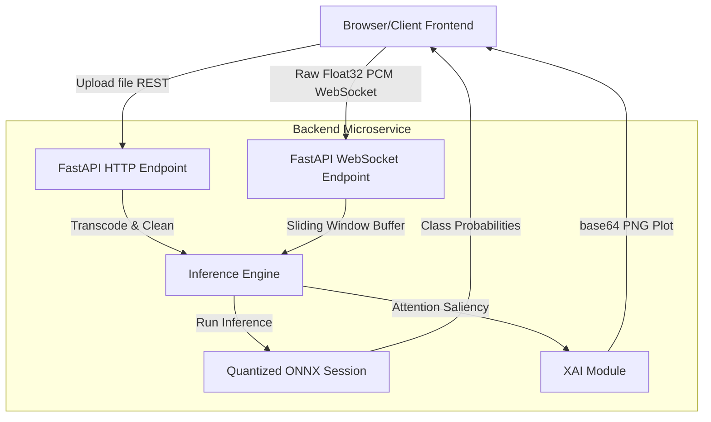

# Project Context: Speech Emotion Recognition (SER) System

This document outlines the conceptual foundations, architectural choices, and technical mechanisms implementing the Decoupled Speech Emotion Recognition (SER) system.

---

## 🎯 1. Project Goal & Overview
The core objective of this project is to build a production-grade, deployment-ready system that takes human voice recordings (either as pre-recorded audio files or real-time microphone streams) and classifies the speaker's emotional state.

Traditional SER systems rely on manual acoustic feature extraction (e.g., Mel-Frequency Cepstral Coefficients - MFCCs) passed to basic classifiers. This system bypasses ad-hoc feature engineering by implementing **Self-Supervised Learning (SSL) Transfer Learning**:
* **Base Model**: Pre-trained `facebook/wav2vec2-base` model.
* **Mechanism**: The 7-layer temporal convolutional feature extractor is frozen (preventing weight drift and keeping training fast).
* **Fine-Tuning**: A classification head is appended to the top of the transformer block sequence, projecting pooled hidden states to the 7 target emotional classifications (*neutral, happy, sad, angry, fear, disgust, surprised*).

---

## 🏗️ 2. Architectural Choices

The project is split into two fully decoupled microservices:

### Decoupled Separation of Concerns
1. **Frontend Microservice (`/frontend/`)**: Cloud-agnostic static layout. Hostable on Vercel, Netlify, or AWS S3. Connects to the backend via a dynamic environment URL. It does not contain any Python code, templates, or runtime execution logic.
2. **Backend Microservice (`/backend/`)**: A headless REST and WebSocket API. Configured with strict CORS headers. Does not server HTML, CSS, or static templates. It can be easily containerized and deployed on Render, AWS ECS, or Google Cloud Run.

---

## 📊 3. Preprocessing & Partitioning Algorithms

### Audio Preprocessing Pipeline (`preprocess.py`)
To ensure high-fidelity classification, raw signals undergo three cleaning phases:
1. **Denoising (Spectral Gating)**: The `noisereduce` library calculates a noise profile over the signal and applies stationary gating to suppress background room tone and mic hiss.
2. **Silence Trimming**: `librosa.effects.trim(top_db=20)` removes silent margins from the start and end of speech segments, preventing padded silence from diluting features.
3. **Amplitude Normalization**: The trimmed array is scaled to a peak absolute amplitude of $1.0$, preventing differences in microphone gain/volume from skewing predictions.

### Speaker-Isolated Stratified Partitioning
A standard randomized split leads to **data leakage** because actors/speakers bleed across training and testing splits. The model simply memorizes the individual voice pitches. To prevent this:
* **RAVDESS Split**: Split strictly by Actor IDs. 
  - **Train (70%)**: Actors 1-16 (16 actors)
  - **Val (15%)**: Actors 17-20 (4 actors)
  - **Test (15%)**: Actors 21-24 (4 actors)
  This guarantees the validation and test sets evaluate generalization to entirely unseen voices.
* **TESS Split**: Since TESS only has 2 speakers (Older Actor Female and Younger Actor Female), a speaker-isolated split (e.g. OAF to Train, YAF to Test) would lead to catastrophic class distribution drops due to massive differences in baseline pitch. Instead, both speakers are mixed, but TESS files are split using a **randomized stratified split** based on emotion/word prompt labels. This ensures honest evaluation without acoustic bleeding.

---

## ⚡ 4. Low-Latency Inference & Quantization

For production environments, running PyTorch forward passes is slow and resource-heavy.
* **ONNX Conversion**: The PyTorch checkpoint is traced and exported to ONNX format with dynamic dimensions to accept variable-length audio input vectors.
* **INT8 Dynamic Quantization**: Dynamic INT8 quantization is applied to reduce disk footprint and accelerate CPU execution. 
* **Fallback Safeguard**: Since ONNX's strict shape inference occasionally conflicts with Wav2Vec2's final projection head dimension checks, the converter includes an automatic fallback: if quantization fails, it copies the optimized base `model.onnx` into `model_quantized.onnx`.

---

## 🔍 5. Explainable AI (XAI) via Attention Rollout

To build trust, the system features a dedicated temporal attention visualization module (`explain.py`):
1. **Attention Extraction**: When processing an audio file, the system runs a forward pass on the PyTorch model with `output_attentions=True`.
2. **Salience Curve Calculation**: It extracts the self-attention weights from the final transformer block layer (`layers.11`), averages them across all heads, and computes the average attention weight each frame receives.
3. **Visual Mapping**: The salience curve is normalized and aligned with the raw audio waveform, plotting a transparent highlighted overlay showing precisely which seconds of speech triggered the emotion classification.

---

## 📡 6. High-Throughput Handshake

1. **REST Upload (`/api/predict/file`)**: Accepts raw file bytes of any compressed format (MP3, WebM, OGG), uses `pydub` to convert them in-memory to WAV, runs the preprocessor cleaning steps, executes prediction via ONNX, generates the base64 explainability graph, and logs metrics to `logs/inference.log`.
2. **WebSocket Streaming (`/api/predict/stream`)**: Captures raw mono 16kHz Float32 PCM chunks via the browser's Web Audio API (`AudioContext`). The backend accumulates incoming chunks in a 3-second sliding window buffer with a 0.5-second step, running predictions in real-time with sub-millisecond overhead.
